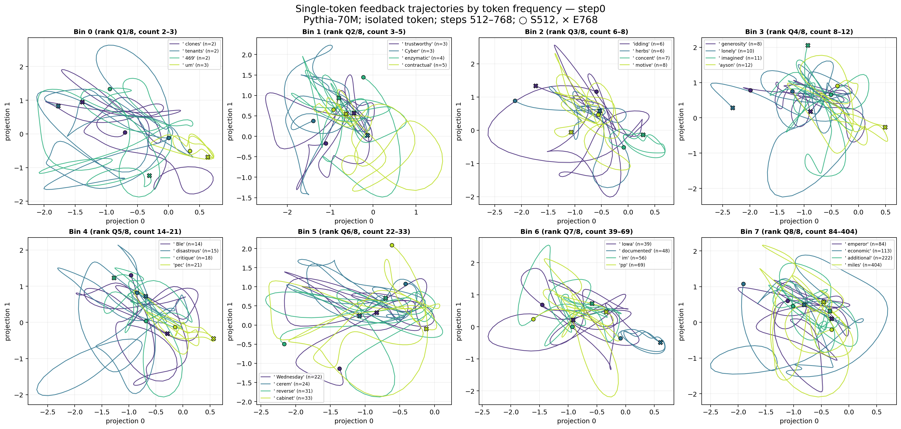
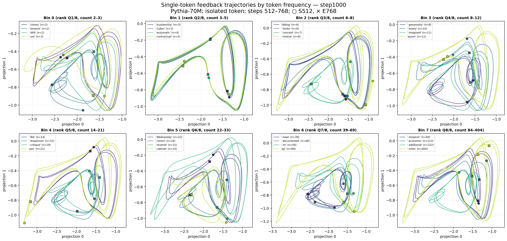
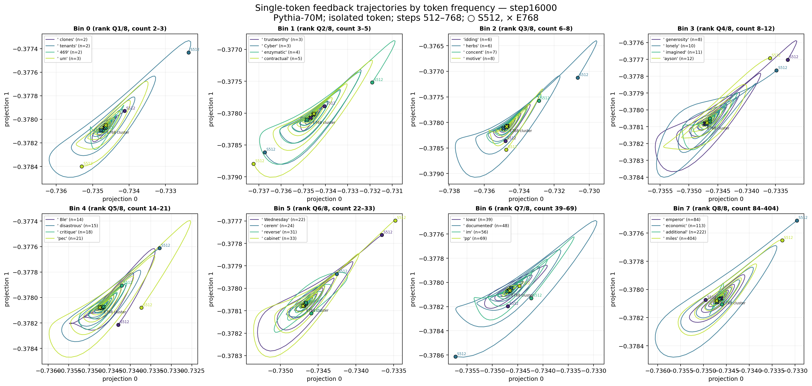
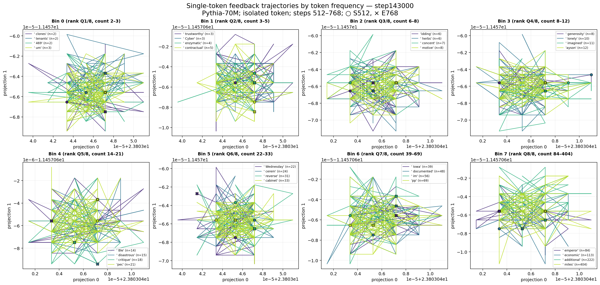
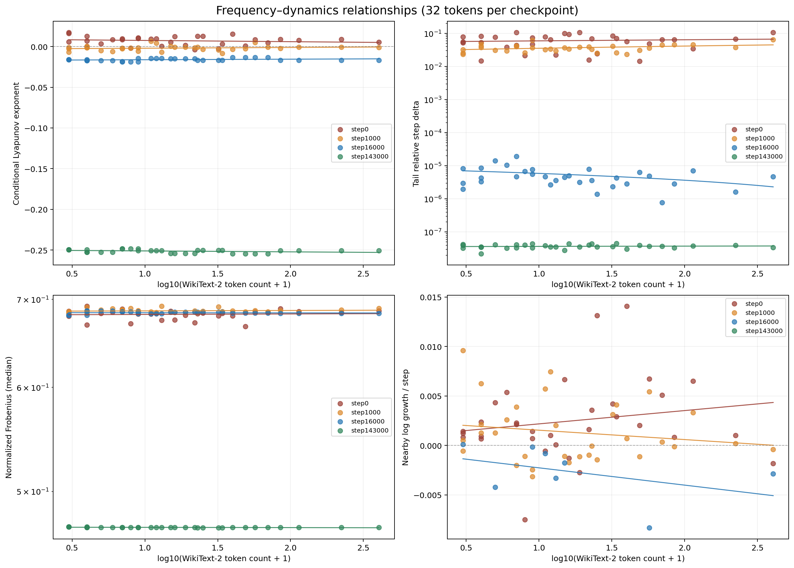
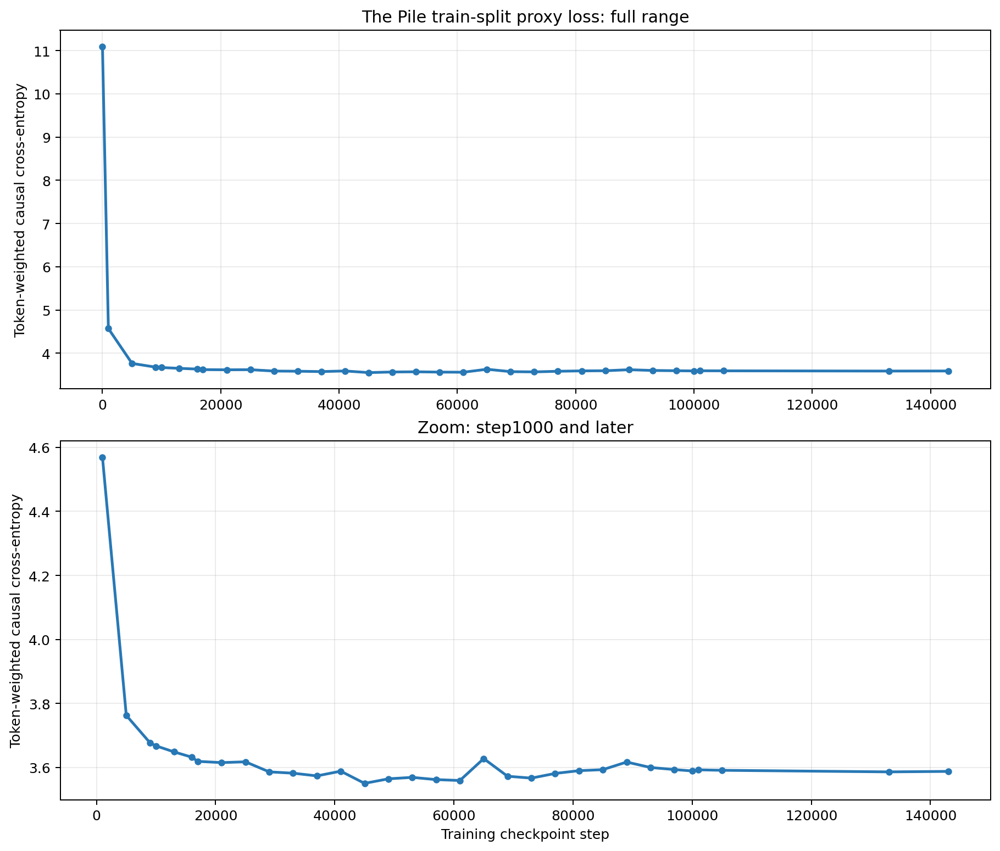
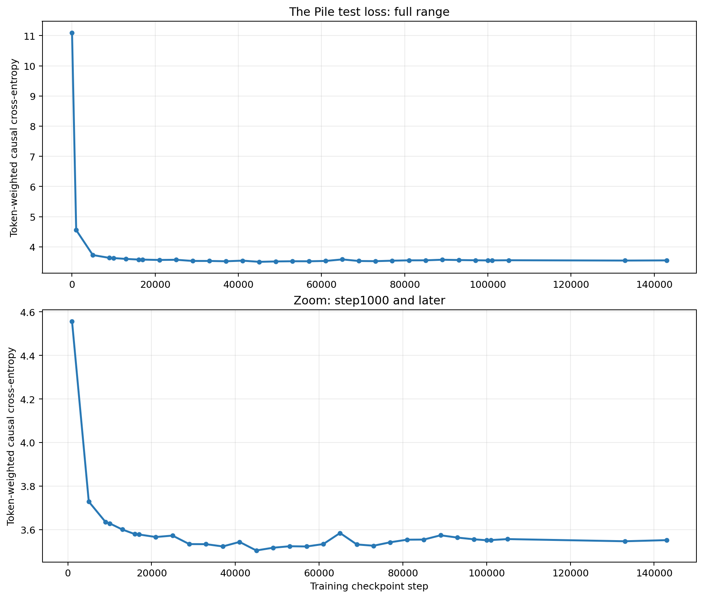
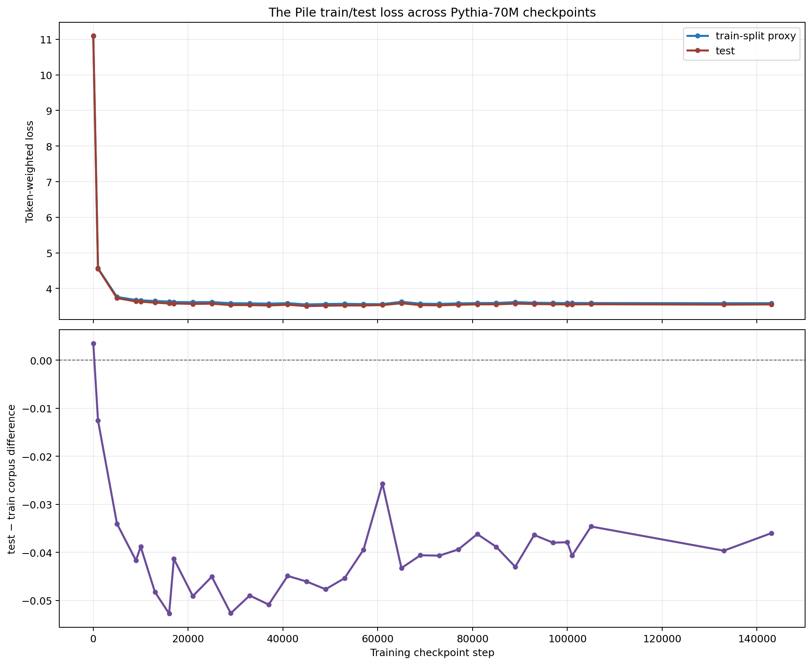
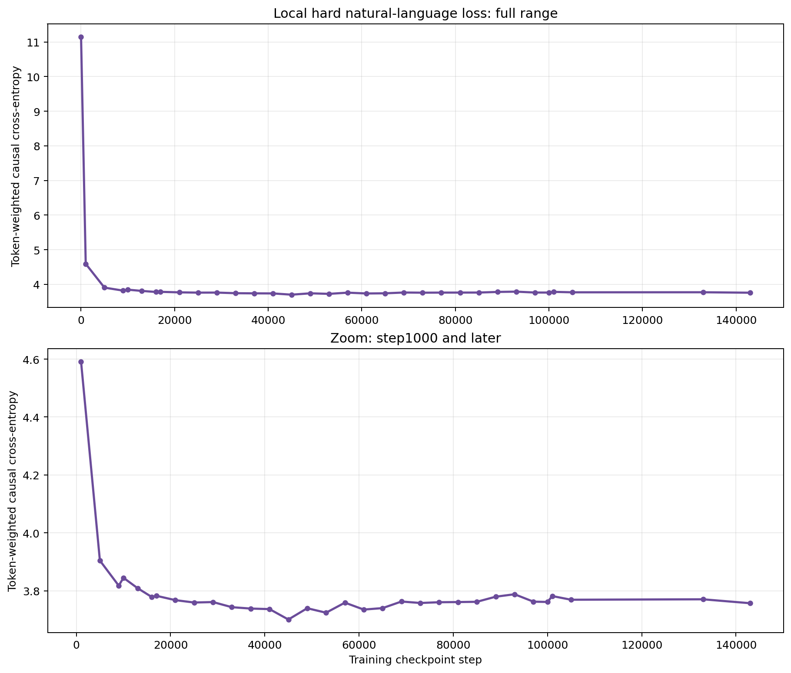

# 单 token 词频动力学与三语料 Loss

状态：`complete`

## 研究问题

本实验回答两个问题：

1. 同一 Pythia-70M checkpoint 下，不同词频 token 进行单 token 循环
   `x_(t+1)=Transformer(x_t)[-1]` 时，投影轨迹与局部动力学指标是否存在稳定差异？
2. Pythia-70M 随 checkpoint 训练时，The Pile train/test loss 如何变化？
3. 换成服务器本地已有、数学内容更密集的自然语言语料后，loss 曲线是否更难？

## 数据与方法

- 模型：`EleutherAI/pythia-70m`
- 单 token 条件：`isolated_token`，序列长度为 1，不使用 LM head、softmax 或 token sampling。
- checkpoint：`step0`、`step1000`、`step16000`、`step143000`。
- 每条轨迹 768 步；图中只展示预注册的 evaluation window `step 512–768`。
- 投影向量在 token 和 checkpoint 之间固定，因此横向比较使用同一坐标系。
- 词频来自 WikiText-2 train split 的重新审计，共 32 个 token、8 档、每档 4 个。
- loss 使用长度 64、512 个固定样本、token-weighted causal cross-entropy。
- test 样本来自 `monology/pile-uncopyrighted` test split。
- train 样本来自 train shard 00 前 20000 个合格记录的确定性 reservoir sample。
- hard natural-language 样本来自本地缓存的 OpenWebMath 两个 Parquet 分片；扫描
  110794 篇，按预注册文本/数学规则得到
  23311 篇合格文档，再以 seed
  `20260725` 的 SHA-256 priority 固定抽取 512 篇。
- hard 集要求至少 1024 字符、
  120 个英文词、ASCII 字母占非空白字符比例至少
  0.55，
  同时要求 OpenWebMath 检测到数学内容且
  `math_score ≥ 0.80`。筛选完全不使用 Pythia loss。
- 三个语料统一使用长度 64、512 个固定样本和 token-weighted causal cross-entropy。

### Token 与词频标注

| 频率档 | 范围 | token（WikiText-2 count） |
|---:|---|---|
| 0 | Bin 0 (rank Q1/8, count 2–3) | ' clones':2 | ' tenants':2 | ' 469':2 | ' um':3 |
| 1 | Bin 1 (rank Q2/8, count 3–5) | ' Cyber':3 | ' trustworthy':3 | ' enzymatic':4 | ' contractual':5 |
| 2 | Bin 2 (rank Q3/8, count 6–8) | 'idding':6 | ' herbs':6 | ' concent':7 | ' motive':8 |
| 3 | Bin 3 (rank Q4/8, count 8–12) | ' generosity':8 | ' lonely':10 | ' imagined':11 | 'ayson':12 |
| 4 | Bin 4 (rank Q5/8, count 14–21) | ' Ble':14 | ' disastrous':15 | ' critique':18 | 'pec':21 |
| 5 | Bin 5 (rank Q6/8, count 22–33) | ' Wednesday':22 | ' cerem':24 | ' reverse':31 | ' cabinet':33 |
| 6 | Bin 6 (rank Q7/8, count 39–69) | ' Iowa':39 | ' documented':48 | ' im':56 | 'pp':69 |
| 7 | Bin 7 (rank Q8/8, count 84–404) | ' emperor':84 | ' economic':113 | ' additional':222 | ' miles':404 |

## 投影结果

每个 panel 中圆点为 evaluation window 起点，叉号为终点。图中已经直接标注 token 文本和词频计数，解决旧图只按 token 文件名分散、难以比较词频的问题。

Spearman 相关（`rho` 是 `log10(count+1)` 与指标的秩相关；每个 checkpoint 有 32 个 token）：

| checkpoint | n | Lyapunov rho | p-value |
|---|---:|---:|---:|
| step0 | 32 | -0.188 | 0.304 |
| step1000 | 32 | 0.191 | 0.296 |
| step16000 | 32 | 0.329 | 0.0656 |
| step143000 | 32 | -0.369 | 0.0374 |

最强的 Lyapunov–词频秩相关出现在 `step143000`：
`rho=-0.369`、`p=0.0374`。尽管总样本增加到 32，
每档仍只有 4 个 token，这里应视为探索性规律而不是确定性词频定律。

两个值得记录、但尚未跨 checkpoint 复现的现象：

- `step143000` 的 normalized Frobenius 随词频升高而降低：
  `rho=-0.629`、`p=0.000114`。
  该关系在前三个 checkpoint 不显著，因此更像“最终收敛状态下的候选规律”，不能写成普遍词频定律。
- nearby-growth 在 `step0` 为正相关
  (`rho=0.220`, `p=0.226`)，
  到 `step1000` 变成负相关
  (`rho=-0.134`, `p=0.465`)；
  两者均不显著，且方向反转，说明 nearby 指标没有稳定的早期词频规律。

整体上 checkpoint 和状态收敛阶段造成的变化大于八个词频档之间的稳定差异：
早期 checkpoint 的轨迹仍有显著运动，最终 checkpoint 多数轨迹收缩到很小区域；
不同 checkpoint 下相关方向并不保证一致。因此现有证据不支持“词频越高就必然更稳定/更混沌”的单调结论。
`step143000` 投影图中的小范围折线主要处于 float32 数值分辨率附近，不应解释为真实高周期吸引子。

## Train/Test Loss

共有 33 个 train/test 共同 checkpoint。最后一个 `step143000`：
train proxy loss=`3.5876`，test loss=`3.5516`，
test−train=`-0.0360`。最低 test loss 出现在
`step45000`，为 `3.5042`（仅指本次固定样本上的观测最小值）。
由于 train proxy 与 test 来自不同分片和不同固定样本，`test−train` 是语料差异，
不是严格的泛化 gap；其负值不表示测试集优于训练集这一通常意义上的结论。

## 本地困难自然语言 Loss

本地 hard 集与 The Pile 使用完全相同的 checkpoint 和 loss 口径。在
33/33 个 checkpoint 上，hard loss 高于 The Pile test；
在 33/33 个 checkpoint 上高于 train proxy。
最后一个 `step143000` 的 hard loss 为
`3.7570`，相比 test 高
`+0.2054`、相比 train proxy 高
`+0.1694`。hard 集的观测最低 loss 出现在
`step45000`，为 `3.7008`。

这里的“困难”是操作性定义：该集合来自数学领域、包含自然语言说明并通过独立规则预先筛选；
其难度由 loss 对比事后核验，而不是用 loss 选择样本。

## 结论

1. 旧实验数据本身已有词频字段；本阶段重新从完整 WikiText-2 audit 中抽取 8 档 × 4 token，并完成同坐标系分组重绘。
2. 单 token 动力学随训练 checkpoint 的变化非常明显；32 个 token 中没有跨 checkpoint 稳定复现的简单词频单调律。
3. Frobenius、Lyapunov、轨迹位移是不同指标；不能用投影图的视觉收缩单独替代稳定性判断。
4. The Pile train/test loss 整体随训练降低；末端是否存在反弹应以 CSV 中相邻 checkpoint 的实际差值判断。
5. 本地 OpenWebMath hard 集在绝大多数 checkpoint 上保持更高 loss，说明模型对数学密集自然语言的建模难度高于当前固定 The Pile 样本。

## 限制

- 词频来自 WikiText-2，不是 Pythia 原始训练语料中的真实 token exposure。
- 每档只有 4 个 token，统计功效仍有限；8 档按 eligible-token rank 分位，而不是等宽 count 区间。
- 序列长度 1 时 attention 退化，结论不能直接外推到正常多 token 生成。
- train loss 是 train-split proxy：只采样 uncopyrighted mirror 的一个 shard，而且该镜像不保证与 Pythia 的精确训练混合一致。
- OpenWebMath hard 集只覆盖本地已有的 2/114 个分片，不代表完整 OpenWebMath；它来自 train split，
  也不能排除与 Pythia 预训练混合存在内容重合。
- “困难自然语言”是领域与文本规则定义，不等价于通用推理能力；数学公式、网页格式和领域术语都会共同抬高 loss。
- `step101000/105000/133000/143000` 的 tokenizer 文件在离线缓存中不完整，因此显式复用了 checkpoint-invariant 的 `step100000` tokenizer。
- float32 下部分 nearby-distance 进入 numerical floor；相关统计对这些行作了排除。

## 可复现产物

- `processed/isolated_token_summary.csv`
- `processed/frequency_bin_summary.csv`
- `processed/frequency_metric_correlations.csv`
- `processed/checkpoint_train_test_loss.csv`
- `processed/checkpoint_three_corpus_loss.csv`
- `figures/single_token_frequency_projection_step0.png`
- `figures/single_token_frequency_projection_step1000.png`
- `figures/single_token_frequency_projection_step16000.png`
- `figures/single_token_frequency_projection_step143000.png`
- `figures/frequency_dynamics_metrics.png`
- `figures/train_loss_by_checkpoint.png`
- `figures/test_loss_by_checkpoint.png`
- `figures/train_test_loss_comparison.png`
- `figures/local_hard_natural_language_loss.png`
- `figures/three_corpus_loss_comparison.png`
- `manifests/the_pile_train.jsonl`
- `manifests/the_pile_train.metadata.json`
- `manifests/open_web_math_local_hard.metadata.json`

生成命令记录在 `RUNBOOK.md`。
