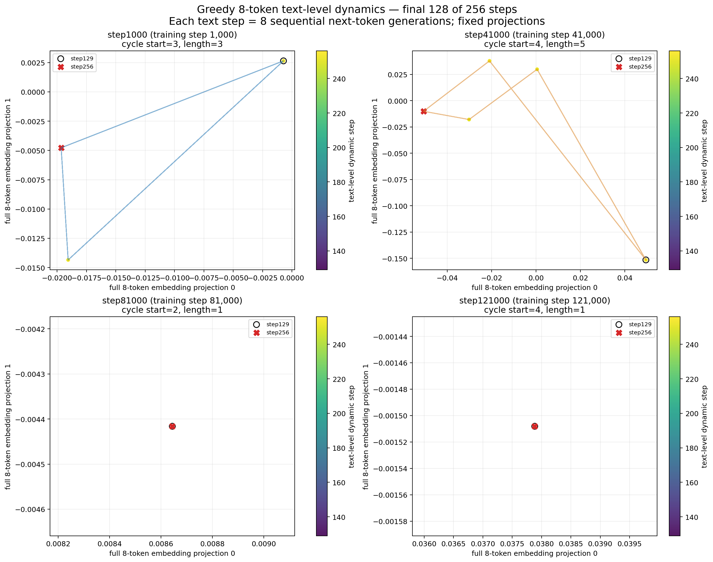

# Full-text token projection dynamics

状态：`complete`

## 定义

- 模型：`EleutherAI/pythia-70m`
- checkpoints：`step1000`、`step41000`、`step81000`、`step121000`，严格间隔 40,000 training steps。
- 初始状态：同一个本地 OpenWebMath 样本的前 8 个 token：`# I About normalization of periodic wave function`。
- 每个微步按正常因果推理执行一次 greedy argmax，只生成 1 个 token。
- 微步之后丢弃窗口中最老的 token，并把新 token 加到末尾；不 padding、不使用 KV cache，position id 每次重置为 `0..7`。
- 连续执行 8 个微步后，窗口正好由 8 个新 token 构成，记为一个 text-level dynamic step。
- 共执行 256 个 text-level steps，即每个 checkpoint 实际生成 2,048 个 token。
- 投影状态是当前完整 8-token 窗口对应的 `8×H` input embedding，展平后使用跨 checkpoint 固定的随机单位向量投影。
- 图中仅使用最后 128 个 text-level steps，即 step129–step256。

## 数据流

```text
8-token window S_t
  -> generate one token and shift window, repeated 8 times
  -> new 8-token window S_(t+1)
  -> embedding lookup E(S_(t+1)) in R^(8×H)
  -> fixed 2-D projection (visualization only)
```

生成第 `j` 个新 token 时，模型看到的是旧窗口尚未移出的后缀以及本轮已经生成的新 token 前缀。
到第 8 个微步结束时，上一轮的 8 个 token 已全部移出。

## 最后 128 步投影



## 摘要

| checkpoint | unique windows | cycle start | cycle length | mean position change | final text |
|---|---:|---:|---:|---:|---|
| step1000 | 6 | 3 | 3 | 1.000 | ` of the function of the function of the` |
| step41000 | 9 | 4 | 5 | 0.950 | `\n\nA:\n\nYou can` |
| step81000 | 3 | 2 | 1 | 0.005 | ` function of the wave function of the wave` |
| step121000 | 5 | 4 | 1 | 0.014 | ` the one that is the one that is` |

`cycle` 按完整 8-token 离散窗口是否重复判定。投影重合本身不用于判定周期。

## 产物

- `processed/checkpoint_summary.csv`
- `figures/full_text_token_projection_last128.png`
- 各 checkpoint 下的 `raw/*__trajectory.jsonl`
- 各 checkpoint 下的 `raw/*__summary.jsonl`

运行命令见 `RUNBOOK.md`。
