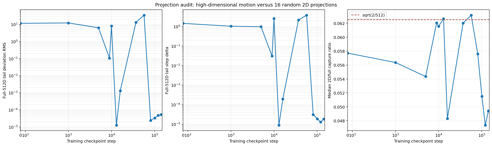
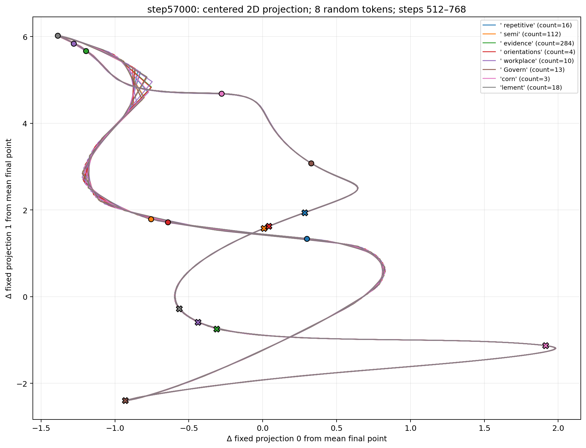
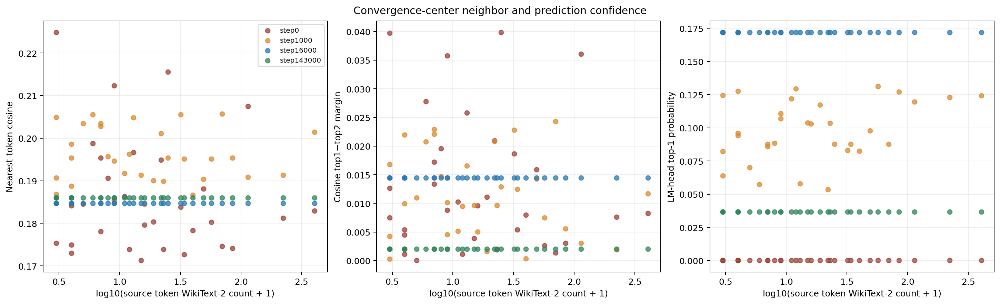
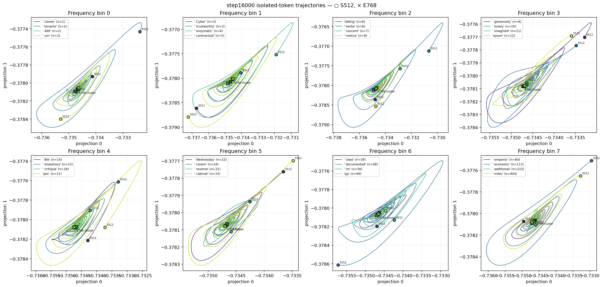
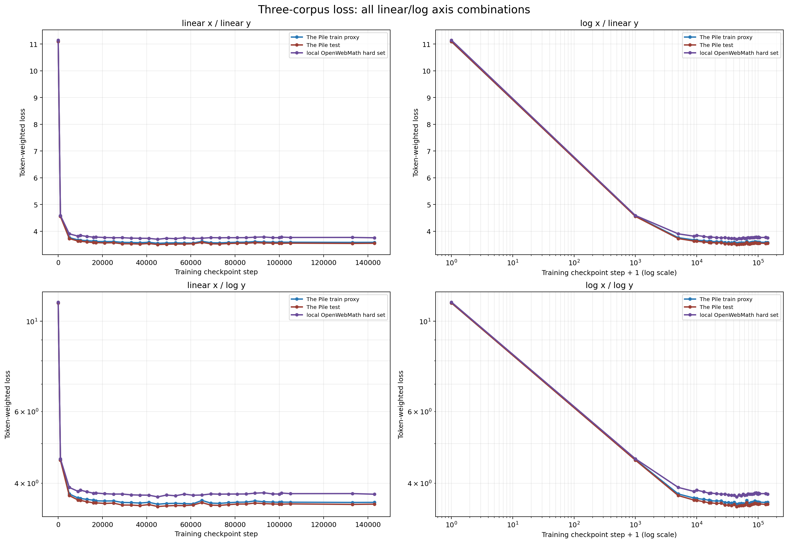

# 实验 13：单 token 收敛中心、词表邻居与输出头置信度

状态：`complete`

## 扩展扫描：12 checkpoint × 8 个完全随机 token

在原 4-checkpoint 分析之外，新增固定 seed `20260727` 的非分层随机扫描。
抽样总体是 WikiText-2 train 中实际出现过、非 special、decode 后含字母或
数字的 token type；从该总体等概率、无放回抽取 8 个，而不是先按词频分档。

抽到的 token 为：

| token | WikiText-2 train count |
|---|---:|
| `' repetitive'` | 16 |
| `' semi'` | 112 |
| `' evidence'` | 284 |
| `' orientations'` | 4 |
| `' workplace'` | 10 |
| `' Govern'` | 13 |
| `'corn'` | 3 |
| `'lement'` | 18 |

“插值”在这里指训练步上的等距目标点，不对 checkpoint 参数做线性混合。
目标点映射到最近的本地真实 Pythia revision：

```text
baseline: step0
1000–16000:  step1000, step5000, step9000, step10000, step13000, step16000
16000–143000: step16000, step37000, step57000, step81000,
              step101000, step121000, step143000
```

其中内部目标到真实 revision 的映射为
`4750→5000`、`8500→9000`、`12250→13000`、
`37167→37000`、`58333→57000`、`79500→81000`、
`100667→101000`、`121833→121000`。

### 扩展结果

| checkpoint | 尾窗相对半径中位数 | 跨 token 中心相对离散度 | 最大 pairwise distance | 几何邻居种类数 | LM top-1 种类数 |
|---|---:|---:|---:|---:|---:|
| step0 | 6.07e-1 | 7.72e-1 | 27.02 | 7 | 6 |
| step1000 | 4.51e-1 | 2.50e-1 | 14.15 | 4 | 2 |
| step5000 | 1.70e-1 | 9.48e-2 | 10.17 | 1 | 1 |
| step9000 | 2.71e-3 | 6.75e-5 | 6.26e-3 | 1 | 1 |
| step10000 | 2.04e-1 | 1.31e-1 | 13.25 | 3 | 2 |
| step13000 | 3.08e-7 | 1.02e-7 | 6.60e-6 | 1 | 1 |
| step16000 | 2.82e-5 | 5.10e-6 | 7.48e-4 | 1 | 1 |
| step37000 | 2.33e-1 | 1.85e-1 | 21.93 | 2 | 3 |
| step57000 | 5.62e-1 | 1.98e-1 | 34.99 | 3 | 3 |
| step81000 | 1.16e-7 | 4.44e-8 | 1.70e-5 | 1 | 1 |
| step101000 | 1.18e-7 | 6.14e-8 | 1.70e-5 | 1 | 1 |
| step121000 | 1.29e-7 | 7.35e-8 | 2.36e-5 | 1 | 1 |
| step143000 | 1.19e-7 | 7.08e-8 | 2.71e-5 | 1 | 1 |

结果不是随训练步单调收缩，而是：

```text
step0/1000 广泛运动
→ step9000 接近收缩
→ step10000 再展开
→ step13000/16000 收缩为共同中心
→ step37000/57000 再次展开
→ step81000–143000 再次收缩为共同中心
```

step5000 的 8 条轨迹虽然已有相同的几何邻居和 LM top-1，但尾窗相对半径
仍为 `0.17`，说明“最近词相同”不能替代动力学收敛判据。该相位结构目前
只由 8 个随机 token、一个抽样 seed 支持，后续应换 seed 复验。

### 随机投影是否制造了假坍塌

旧图坐标轴上的 `1e-5` 和 `+1.10043e1` 是 Matplotlib 的科学计数法与
offset，表示真实坐标为：

```text
1.10043e1 + 图上刻度 × 1e-5
```

即轨迹围绕约 `11.0043` 的投影值仅变化 `1e-5`，不是 projection vector
“选在 fixed point 上”。projection 是方向，不是状态空间中的点。

对任意固定的非零 512 维位移，连续随机方向与它精确正交的概率为 0。
若用近似正交的两个随机单位方向组成二维投影，捕获范数比例的典型量级为：

```text
sqrt(2 / 512) = 0.0625
```

把真实位移压小 100 倍以上（二维捕获比例 ≤ 0.01）的概率约为 2.5%；
压小 1000 倍以上（≤ 0.001）的概率约为 0.0255%。这还是对单个固定
位移的概率；要同时隐藏多个 token、多个时间步的运动，概率更低。

本实验已从一对投影扩展为 16 对独立随机投影。各 checkpoint 的实测
median capture ratio 为约 `0.048–0.063`，与理论 `0.0625` 一致。更关键
的是直接在完整 512 维空间测得：

| checkpoint | full-512D tail deviation RMS | full-512D tail step delta |
|---|---:|---:|
| step9000 | 1.06e-1 | 3.07e-2 |
| step10000 | 7.97 | 2.53 |
| step13000 | 1.28e-5 | 8.93e-6 |
| step16000 | 1.31e-3 | 1.94e-4 |
| step37000 | 13.22 | 2.17 |
| step57000 | 34.67 | 3.81 |
| step81000 | 2.43e-5 | 3.13e-5 |

所以 step13000、step81000 的坍塌在未投影的 512 维状态中也存在，不是
二维投影伪影。step13000 的量级已接近 float32 数值分辨率，应解释为
“数值意义上固定”，不能用图中的微小锯齿推断真实高周期轨道。更新后的
投影图以平均最终点为原点画 `Δprojection`，不再显示容易误读的 offset。



### 最终 dynamic-step vector 的最近词

这里分析的是每条轨迹最后的 `h_768`，不同于前文对 `step705..768` 求均值
得到的收敛中心。完整结果在
`processed/random8_final_vector_neighbors.csv`。

| checkpoint | 最终 cosine 最近邻 | WikiText-2 count | median cosine similarity | LM-head top-1 | median top-1 p |
|---|---|---:|---:|---|---:|
| step9000 | `atom` (8/8) | 15 | 0.1636 | newline (8/8) | 0.2197 |
| step10000 | `holder` (4/8)，`ervation` (3/8)，` NAC` (1/8) | 3 / 8 / 2 | 0.1734 | newline (6/8)，space (2/8) | 0.1106 |
| step13000 | `escap` (8/8) | 1 | 0.1888 | newline (8/8) | 0.0858 |
| step16000 | `م` (8/8) | 3 | 0.1848 | ` me` (8/8) | 0.1719 |
| step37000 | 6 种不同邻居 | — | 0.1801 | 4 种不同输出 | 0.0951 |
| step57000 | 5 种不同邻居 | — | 0.1785 | `^` (6/8) | 0.0713 |
| step81000 | `893` (8/8) | 0 | 0.1910 | ` Four` (8/8) | 0.0721 |
| step101000 | ` evade` (8/8) | 9 | 0.1876 | ` Kell` (8/8) | 0.0243 |
| step121000 | `ourier` (8/8) | 7 | 0.1982 | ` decre` (8/8) | 0.0234 |
| step143000 | `ôle` (8/8) | 0 | 0.1860 | ` errone` (8/8) | 0.0366 |

这些 cosine similarity 只有约 `0.16–0.20`，对应 cosine distance
`0.80–0.84`，属于较弱的几何相似；最近词只是“整个词表里相对最近”，
不表示语义等价或高置信预测。

### 指标说明

设最终 hidden vector 为 `h`，某个 input token embedding 为 `e_i`。

**Cosine similarity**

```text
cos(h, e_i) = (h · e_i) / (||h|| ||e_i||)
```

只比较方向，不关心向量长度。取值范围 `[-1,1]`：1 表示同方向，0 表示
正交，-1 表示反方向。

**Cosine distance**

```text
d_cos(h, e_i) = 1 - cos(h, e_i)
```

0 最接近，1 约为正交，2 为反方向。CSV 当前保存 similarity；distance
可直接用 `1 - cosine_similarity` 得到。

**Cosine nearest neighbor**

在该 checkpoint 的全部 input embedding 中寻找 cosine similarity 最大
的 token。它回答“h 的方向最像哪个输入 token embedding”，但不是模型
实际输出，因为 Pythia 的 output head 是另一组权重。

**LM-head top-1**

把 hidden vector 经 checkpoint 的语言模型输出头：

```text
logits = W_out h
probabilities = softmax(logits)
```

概率最大的 token 才是该 vector 在标准 next-token 解码意义下的 top-1
prediction。它与 cosine nearest neighbor 不一致是正常现象。

**Top-1 probability**

LM-head softmax 后最大概率。它是当前完整词表分布中的相对置信度，但未经
校准，不能直接当作真实正确率。

**Top1−top2 margin**

- cosine margin：最近与第二近 input embedding 的 cosine 差；
- logit margin：LM-head 第一、第二名 logit 的差。

margin 越小，第一名越容易因数值扰动或 checkpoint 变化而换位。

**Cosine vocabulary z-score**

top-1 cosine 相对于整个词表 cosine 分布高出多少个标准差。它衡量“第一名
相对词表背景是否突出”，仍不是概率。

**Normalized entropy**

LM-head 全词表概率分布的熵除以 `log(vocab_size)`，范围约 `[0,1]`。
越接近 0 越集中，越接近 1 越分散。

**WikiText-2 count**

对应 token 在 WikiText-2 train 的出现次数。0 表示该 tokenizer token 在
这份语料中未出现，不表示它在 Pythia 原始训练数据中从未出现。

每个 checkpoint 只有一张投影图，图中同时画 8 个 token；例如：



扩展扫描产物：

- `processed/random8_selected_tokens.csv`
- `processed/random8_checkpoint_trajectory.csv`
- `processed/random8_convergence_center_neighbors.csv`
- `processed/random8_final_vector_neighbors.csv`
- `processed/random8_projection_diagnostics.csv`
- `processed/random8_checkpoint_summary.csv`
- `processed/random8_convergence_centers.pt`
- `figures/random8_checkpoint_scan/random8_projection_step*.png`（12 张）
- `random8_scan_complete.json`

## 目的与口径

本实验复用实验 11 的 4 个 checkpoint × 32 个 token × 769 个已保存
hidden states，不重新运行动力学。对每条轨迹取 `step705..768` 共 64 个
target hidden states 的算术平均作为“收敛中心”，并保存完整的
`128 × 512` 中心张量。

对每个中心分别计算：

1. checkpoint 输入 embedding 词表中的 cosine 最近 token、top1−top2
   margin、相对全词表的 z-score，以及欧氏最近 token；
2. 将中心直接送入该 checkpoint 的 LM output head，计算真实 top-1
   token、softmax probability、top1−top2 logit margin 和归一化熵；
3. 最近 token 与 LM-head top-1 在 WikiText-2 train 原始语料中的 token
   频数。词频统计严格复用实验 11 的 tokenizer 和整份 train split，
   共 2,419,745 个 token、33,160 个出现过的 token type。

`geometry_confidence` 只是透明的邻居分离度标签，不是概率校准：
`high` 要求 z-score ≥ 5 且 cosine margin ≥ 0.02，`moderate` 要求
z-score ≥ 3 且 margin ≥ 0.005，其余为 `low`。真正的 next-token
置信度应看 LM-head probability / entropy。

## 主要结果

| checkpoint | 中心轨迹内相对半径中位数 | 跨 token 中心相对离散度 | cosine 最近邻 | 原始语料频数 | cosine / margin | LM-head top-1 | top-1 p |
|---|---:|---:|---|---:|---:|---|---:|
| step0 | 6.25e-1 | 7.82e-1 | 不同 token 不同 | — | median 0.183 / 0.0092 | 不同 token 不同 | median 0.00017 |
| step1000 | 4.19e-1 | 3.09e-1 | 不同 token 不同 | — | median 0.195 / 0.0101 | `.`(25/32)、`:`(7/32) | median 0.0969 |
| step16000 | 3.80e-5 | 9.29e-6 | `م` (32/32) | 3 | 0.18476 / 0.01446 | ` me` (32/32) | 0.17188 |
| step143000 | 1.22e-7 | 8.99e-8 | `ôle` (32/32) | 0 | 0.18602 / 0.00204 | ` errone` (32/32) | 0.03662 |

step16000 的跨 token 最大 pairwise center distance 只有 `0.00201`，
step143000 更只有 `3.02e-5`；它们确实是几乎与初始 token 无关的共同
吸引中心，不只是 top-1 邻居碰巧相同。相比之下，step0 和 step1000 的
最大 pairwise distance 分别为 `28.50` 和 `21.37`，尾窗也仍在明显运动，
不能把其尾窗均值当作严格固定点。

最重要的解释限制是：收敛中心和输入 embedding 最近邻的 cosine 仅约
`0.185`，而且所有 128 行中 cosine 邻居与 LM-head top-1 的一致率都是
0。也就是说，`م` / `ôle` 只是输入 embedding 空间中的低相似度几何邻居，
不是模型在该状态下的 prediction。若问“类似于什么 prediction”，应以
output head 为准：step16000 类似一个对 ` me` 给出约 17.2% 概率的
next-token prediction；step143000 类似一个较分散、对 ` errone` 仅给出
约 3.66% 的 prediction。Pythia 的 input embedding 与 output head 不能在
本实验里混为同一个度量空间。



## step16000 起终点

图中只画预注册 evaluation window。`○ S512` 是保存状态 `state[512]`
经下一次记录对应的窗口起端，`× E768` 是最终端；标识也已同步回实验
11 的原图。



## 当前 single-token 实验的数据流

实验 11 实际执行的是 `isolated_token`，不是长度为 N 的 token 序列：

```text
checkpoint
  -> 取 token_id 的 input embedding，形状 [H]
  -> reshape 为 [L=1,H]，再加 batch 维成为 [1,1,H]
  -> attention_mask=[1]，position_ids=[0]，无 padding、use_cache=False
  -> 只调用 GPT-NeoX transformer body，不调用 LM head/softmax/sampling
  -> transformer 返回 [1,1,H]
  -> 取最后位置 [-1] 得到新的 [H]
  -> 反馈 768 次
```

因此当前实验既不是“输出 N 个 token 后取第一个”，也不是“固定
sequence length 后加载 padding”。它每步只有一个位置，`[-1]` 就是唯一
位置。

代码中的 `dynamic_context` 是另一种算子。若状态长度为 N，它每步会让
transformer 返回全部 N 个 hidden states `[N,H]`，并把全部 N 个 state
同步反馈到下一步；用于 target 轨迹和局部 Jacobian 的是最后一个位置
`state[-1]`，不是第一个位置。因果 mask 使早期位置不会受到末位置影响，
但早期位置本身仍会被计算并返回。实验 11 的四份配置都只启用了
`groups: [isolated_token]`，所以这些 dynamic-context 行为没有进入当前
实验 11 结果。

## 与工业自回归生成的关系

checkpoint 本身不规定“截断输出”或“一次输出 N 个新 token”。标准
causal LM 对长度 N 的输入，一次 forward 返回 N 个位置的 hidden
states/logits；这些 logits 是每个已有位置上的 next-token 分布，不等于
并行生成 N 个新 token。正常生成取最后一个有效输入位置的 logits，选出
一个新 token，再继续下一步：

- 无 KV cache：每生成一个 token，重新 forward 当前整段输入；
- 有 KV cache：第一次对 N 个 prompt token 做 prefill，之后通常每次只
  输入一个新 token，同时复用并扩展历史 K/V；
- 固定工程窗口：当上下文超过 `seqlen`，应用层通常裁掉最旧 token 或
  拒绝/截断输入；模型输出的序列维仍等于这次实际送入的长度；
- padding：模型仍会为 padded 位置产生张量。attention mask 只能阻止它们
  作为有效上下文被关注，调用方还必须从“最后一个非 pad 位置”取 logits，
  不能盲取数组最后位置。右 padding 下尤其容易取错。

实验 12 的滚动生成代码展示了更接近真实工程的方式：窗口长度固定为 8，
但内部仍连续做 8 次 `logits[:, -1, :] -> argmax -> 滑窗追加`，并不是一次
forward 同时产生 8 个 token。

## Loss 对数重画的新观察

实验 11 的 `three_corpus_loss_comparison.png` 已改为四宫格，同时展示：

1. linear x / linear y；
2. log x / linear y；
3. linear x / log y；
4. log x / log y。

横轴取 log 时使用 `training_step + 1`，从而保留 step0。四种组合也分别
保存为单独 PNG；含负值的 corpus difference 另存为线性坐标图。

- 从 step0 到 step1000 已完成“step0 到观测最小值”总降幅的
  86.1%（test）、86.5%（train）和 88.0%（hard）。最强变化集中在最早期。
- step1000 之后的 `log(loss) ~ log(training step)` 斜率只有
  `-0.0308`（test）、`-0.0302`（train）、`-0.0242`（hard），三条曲线
  近似平行进入平台，不支持一个清晰的新幂律区间。
- 三个语料的观测最低点都在 step45000，之后到 step143000 分别反弹
  `+0.0474`、`+0.0374`、`+0.0562`；这不是 log 轴制造的视觉效应。
- hard−test gap 在 step1000 为 `0.0348`，到 step57000 达到最大
  `0.2365`，末端仍为 `0.2054`。通用 loss 快速下降后，数学密集语料的
  相对领域差距反而更清楚。



## 产物与复现

- `processed/convergence_center_neighbors.csv`：128 条逐
  checkpoint/token 完整结果及 top-5。
- `processed/checkpoint_summary.csv`：跨 token 汇总和中心离散度。
- `processed/convergence_centers.pt`：128 个 `float32[512]` 中心向量。
- `figures/convergence_neighbor_confidence.png`
- `figures/single_token_frequency_projection_step16000_endpoints.png`
- `run_complete.json`

复现命令（纯分析/推断，不训练）：

```bash
MPLCONFIGDIR=/tmp/model_feature_mpl \
PYTHONPATH=/public/luohaoming/model_feature/.venv/lib/python3.9/site-packages \
python experiments_ordered/13_single_token_convergence_neighbors/scripts/analyze_convergence_neighbors.py \
  --device cpu
```

扩展扫描复现命令：

```bash
MPLCONFIGDIR=/tmp/model_feature_mpl \
PYTHONPATH=/public/luohaoming/model_feature/.venv/lib/python3.9/site-packages \
python experiments_ordered/13_single_token_convergence_neighbors/scripts/run_interpolated_checkpoint_scan.py \
  --device cuda:7
```
