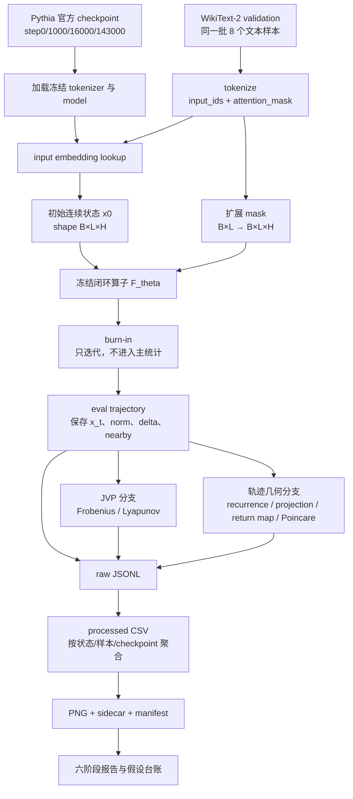
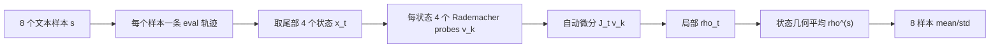

# LLM 临界性实验数据流技术详解

## 文档目的

本文独立说明当前项目从“数据和 checkpoint”到“动力学指标、图表与研究结论”的完整数据流。重点回答：

- 模型有没有重新训练；
- 一条文本如何变成动力学初始状态；
- padding、causal mask 和固定序列尺寸如何处理；
- hidden state 如何循环成为下一步输入；
- burn-in 和 eval window 如何分工；
- JVP、Frobenius、Lyapunov 如何由文本样本、轨迹状态和随机 probe 分层计算；
- JSONL、processed CSV、图表和报告之间是什么关系；
- 哪些聚合会丢失信息，复核结论时应回到哪一级数据。

## 一、全局数据流



整条链中只有官方 checkpoint 自身来自模型训练。本项目的动力学运行过程始终冻结权重，不执行 backward 或 optimizer update。

## 二、配置、代码和数据目录之间的关系

### 入口配置

一个典型 checkpoint 配置包含：

```yaml
models:
  - name: EleutherAI/pythia-70m
    revision: step16000

dataset:
  name: wikitext
  config: wikitext-2-raw-v1
  split: validation
  num_samples: 8
  sequence_lengths: [64]

dynamics:
  target: final_hidden
  operator_update: direct
  token_mode: nonpad_flattened
  burn_in_steps: 512
  eval_steps: 128
  perturbation_epsilon: 1.0e-3
  frobenius_eval_states: 4
  frobenius_probes: 4
  lyapunov_probes: 2
  probe_distribution: rademacher
```

主要入口文件是：

- `scripts/compute_dynamical_edge.py`：加载数据/模型，构造算子，运行每个样本并写 raw JSONL；
- `src/dynamics.py`：轨迹、mask 范数、JVP、Frobenius、Lyapunov、lag distance；
- `src/visualization_utils.py`：Projected Poincaré crossing；
- `scripts/analyze_checkpoint_long_asymptotic.py`：跨样本/checkpoint 聚合；
- `scripts/build_experiment_visual_review.py`：生成24张图、sidecar 和 manifest。

### 存储边界

```text
/data1/luohaoming/model_feature/
├── configs/                  可复现参数
├── scripts/                  执行和分析程序
├── src/                      核心动力学实现
├── tests/                    单元测试
├── plan/                     实验计划
├── reports/                  Markdown 报告与精选压缩图
└── results/                  部分历史 processed 数据

/home/luohaoming/model_feature_experiments/
└── pythia_checkpoint_criticality/
    ├── long_asymptotic/      主 Frobenius/Lyapunov 数据
    └── visualization_rerun/  三投影轻量复测数据

/home/luohaoming/model_feature_reports/
└── experiment_visualization_review/
    ├── phase_01 ... phase_06 全分辨率图
    ├── figure_manifest.csv
    ├── figure_manifest.md
    └── build.log
```

原则是：大体积实验数据放 `/home/luohaoming`，仓库保存代码、配置、报告和压缩图；旧 raw 数据不覆盖。

## 三、checkpoint 数据流：不是重新训练模型

四个 checkpoint：

```text
step0
step1000
step16000
step143000
```

表示 Pythia 官方预训练过程中的四套参数：

$$
\theta_0,\theta_{1000},\theta_{16000},\theta_{143000}.
$$

实验对每套参数独立加载模型，然后设置为推理/求导分析状态。虽然 JVP 需要对输入建立 autograd 图，但模型参数不更新：

```text
加载 θ_s
→ 固定 θ_s
→ 对输入 x 求 ∂F_θs(x)/∂x
→ 不计算 ∂loss/∂θ_s
→ 不执行 optimizer.step()
```

因此训练 step 只是选择 $\theta_s$；动力学 step 才是固定 $\theta_s$ 下的迭代时间。

## 四、文本到初始状态的数据流

### 4.1 文本抽样

从 WikiText-2 validation 读取同一批8个文本。相同 seed 和样本顺序用于四个 checkpoint，目的是让 checkpoint 差异不被输入样本差异混淆。

记第 $s$ 个文本为：

$$
\mathcal T^{(s)},\qquad s=1,\ldots,8.
$$

### 4.2 Tokenization

tokenizer 输出：

```text
input_ids:      [B,L]
attention_mask: [B,L]
```

当前 checkpoint 主实验通常为：

```text
B = 1
L = 64
```

若文本不足64 token，则右侧 padding；若过长，则按配置截断。

### 4.3 Embedding lookup

初始连续状态是输入 embedding：

$$
x_0=E_\theta[\text{input\_ids}],
$$

尺寸为：

$$
x_0\in\mathbb R^{B\times L\times H}.
$$

Pythia-70M 的 $H=512$，所以无 padding 的 seq64 样本展开后有效维数为：

$$
D=64\times512=32768.
$$

## 五、mask 和 padding 数据流

### 5.1 mask 扩展

原始 mask：

$$
m\in\{0,1\}^{B\times L}
$$

扩展为与 hidden state 同形：

$$
\widetilde m\in\{0,1\}^{B\times L\times H}.
$$

概念上执行：

```text
[B,L] → [B,L,1] → broadcast → [B,L,H]
```

### 5.2 每一步三次约束

1. 轨迹初始化时：

$$
x_0\leftarrow x_0\odot\widetilde m.
$$

2. 每次送入模型前：

$$
x_t^{\mathrm{in}}=x_t\odot\widetilde m.
$$

模型同时收到原始 `attention_mask`，所以 causal attention 不把 padding key/value 当作有效上下文。

3. 模型输出和 update mode 完成后：

$$
x_{t+1}\leftarrow x_{t+1}\odot\widetilde m.
$$

输出后再次清零是必要的，因为 padding query 位置仍可能因 bias、position information 或 normalization 产生非零 hidden state。

### 5.3 指标中的 mask

状态范数、step delta、nearby distance 都只计算 active dimensions：

$$
\|x\|_{m}=\|x\odot\widetilde m\|_2.
$$

Frobenius/Lyapunov probe 在输入 JVP 前清零 padding，JVP 输出后再次清零。归一化维数使用：

$$
D=L_{\mathrm{nonpad}}H,
$$

而不是始终使用 $LH$。

## 六、冻结反馈算子内部数据流

### 6.1 单次 forward

对当前状态 $x_t$：

```python
outputs = model(
    inputs_embeds=x_t,
    attention_mask=attention_mask,
    output_hidden_states=True,
    use_cache=False,
)
```

`use_cache=False` 表示每个 dynamics step 都重新计算固定长度序列，不沿 dynamics time 复用 autoregressive KV cache。

### 6.2 主 target：final hidden

$$
G_\theta(x_t)=H_L(x_t),
$$

其中：

```text
input  x_t:       [B,L,H]
output H_L(x_t):  [B,L,H]
```

尺寸相同，所以可以闭环。

### 6.3 替代 target：embedding expectation

$$
p_{t,i}=\operatorname{softmax}(\operatorname{logits}_{t,i}/T),
$$

$$
G_{\theta,T}(x_t)_i=p_{t,i}E_\theta.
$$

输出仍为 `[B,L,H]`，但它位于词表 embedding 的凸组合空间，而 final hidden 没有这种限制。

### 6.4 update mode

先定义：

$$
\widetilde G_\theta(x)=\beta G_\theta(x).
$$

然后：

| mode | 输出状态 |
|---|---|
| direct | $F(x)=\widetilde G_\theta(x)$ |
| residual | $F(x)=(1-\alpha)x+\alpha\widetilde G_\theta(x)$ |
| norm matched | $F(x)=\widetilde G_\theta(x)\|x\|/(\|\widetilde G_\theta(x)\|+10^{-12})$ |
| residual norm matched | residual mixing 后再匹配到 $\|x\|$ |

主 checkpoint 实验是：

```text
target          = final_hidden
operator_update = direct
output_scale    = 1
```

即：

$$
x_{t+1}=F_{\theta_s}(x_t)=H_L(x_t;\theta_s).
$$

## 七、这是 causal，但不是逐 token 自回归生成

每次 Transformer forward 内部仍使用 causal mask：位置 $i$ 只能读取当前输入中 $j\le i$ 的有效位置。

但动力学外循环不是：

```text
预测一个 token → 追加到序列 → 长度增加
```

而是：

```text
整段 [B,L,H]
→ 同步计算全部 L 个输出位置
→ 整段回灌
→ 尺寸仍为 [B,L,H]
```

因此最准确的描述是：

> 单次 forward 保留 causal attention；动力学时间采用固定长度连续状态的同步更新，不执行离散 token 采样或 autoregressive append。

## 八、轨迹、burn-in 和 eval window

### 8.1 初始轨迹

对每个文本样本：

$$
x_{t+1}=F_\theta(x_t).
$$

同时构造邻近轨迹：

$$
x'_0=x_0+\epsilon u,
\qquad \|u\|_2=1,
$$

并同步迭代：

$$
x'_{t+1}=F_\theta(x'_t).
$$

### 8.2 burn-in

主协议先执行512步：

```text
t = 1 ... 512
```

这部分状态不进入主轨迹统计，用于减小初始文本 embedding 暂态的影响。它是对原论文“渐近状态”思想的窗口化扩展，不是论文500步参数的逐字复刻。

### 8.3 eval window

long-asymptotic 主协议随后记录128步：

```text
t = 513 ... 640
```

三投影复测记录256步：

```text
t = 513 ... 768
```

每个记录状态保存：

$$
n_t=\|x_t\|_m,
$$

$$
\Delta_t=\|x_t-x_{t-1}\|_m,
$$

$$
r_t=\frac{\Delta_t}{\max(n_t,10^{-12})},
$$

$$
d_t=\|x'_t-x_t\|_m.
$$

### 8.4 停止条件

若：

```text
state_norm > divergence_threshold
```

则标记 diverged；若：

```text
state_norm < collapse_threshold
```

则标记 collapsed。发生后可提前停止该样本轨迹。

## 九、Frobenius/JVP 数据流

### 9.1 不显式生成 Jacobian

在状态 $x_t$：

$$
J_t=DF_\theta(x_t).
$$

对于 seq64 Pythia-70M，$J_t$ 约为 `32768×32768`。代码不保存这个矩阵，而调用自动微分计算：

$$
J_tv_k.
$$

### 9.2 三层离散抽样

Frobenius 中“样本”有三层：



每个 checkpoint 的 JVP 数量为：

$$
8\text{ texts}\times4\text{ states}\times4\text{ probes}=128\text{ JVPs}.
$$

### 9.3 单状态估计

Rademacher probe：

$$
v_k\in\{-1,+1\}^{D},\qquad \mathbb E[v_kv_k^\top]=I.
$$

因为：

$$
\mathbb E_v\|J_tv\|_2^2=\|J_t\|_F^2,
$$

所以：

$$
\rho_t=sqrt{\frac1{DK}\sum_{k=1}^{K}\|J_tv_k\|_2^2}
\approx\frac{\|J_t\|_F}{\sqrt D}.
$$

### 9.4 状态和文本聚合

一个文本样本取最后4个 eval states：

$$
\rho^{(s)}_{\mathrm{geo}}
=\exp\left(\frac14\sum_{t=1}^{4}\log\max(\rho_t^{(s)},10^{-12})\right).
$$

checkpoint 汇总：

$$
\overline\rho=\frac18\sum_{s=1}^{8}\rho^{(s)}_{\mathrm{geo}},
$$

并计算样本间标准差。

重要：多个轨迹状态不是共同拟合一个 $J_t$；每个 $x_t$ 都有自己的局部 $J_t$，多个状态只用于时间/吸引子平均。

## 十、Benettin Lyapunov/JVP 数据流

Lyapunov 使用相同的 JVP 原语，但随机方向不是每个状态重新采样。

对一个 probe：

$$
v_0\leftarrow\frac{v_0}{\|v_0\|},
$$

每步：

$$
w_t=J_tv_t,
$$

$$
a_t=\|w_t\|_2,
$$

$$
v_{t+1}=w_t/a_t.
$$

最终：

$$
\widehat\lambda^{(s,p)}=\frac1T\sum_{t=1}^{T}\log a_t.
$$

当前每文本使用2个 Lyapunov probes：

```text
8 texts × 2 propagated tangent probes
```

每个 probe 都沿完整 eval window 传播。先在 probe 间求 mean/std/max，再跨8个文本求 checkpoint mean/std。

区别总结：

| Frobenius | Lyapunov |
|---|---|
| 每状态重新采样独立 probe | 切向量跨状态连续传播 |
| 估计当前所有方向的 RMS 增益 | 逐渐对齐长期主扩张方向 |
| 只取尾部4个状态 | 使用完整 eval trajectory |
| 参考线为1 | 参考线为0 |

## 十一、nearby、recurrence 和投影数据流

### 11.1 nearby distance

记录：

$$
d_t=\|x'_t-x_t\|_m.
$$

辅助汇总：

$$
R_d=d_T/d_0,
$$

$$
g_d=\log(R_d)/T.
$$

注意：$x'_0$ 在 burn-in 前构造，所以 `final_to_initial_separation` 包括 burn-in；图中的 nearby curve 只显示 burn-in 后记录部分。

### 11.2 lag recurrence

对 lag $k$：

$$
D_k=\frac1{T-k}\sum_{t=0}^{T-k-1}\|x_{t+k}-x_t\|_m.
$$

processed 热图使用：

$$
\widetilde D_k=D_k/\overline{\|x_t\|_m}.
$$

### 11.3 固定随机投影

生成3个共享单位方向：

$$
q_0,q_1,q_2,
$$

seed为1234，并在 checkpoint 和文本样本之间保持一致。每个状态写出：

$$
z_i(t)=\langle x_t,q_i\rangle,
$$

对应字段：

```text
projection_0
projection_1
projection_2
projection_0_next
projection_1_next
projection_2_next
```

### 11.4 return map

直接画：

$$
(z_0(t),z_0(t+1)).
$$

### 11.5 Projected Poincaré

每个 checkpoint×sample 单独取其 $z_0$ 中位数：

$$
c=\operatorname{median}_t z_0(t).
$$

保留向上 crossing：

$$
z_0(t-1)\le c<z_0(t),
$$

输出：

$$
(z_1(t),z_2(t)).
$$

processed 字段为：

```text
section_value
crossing_order
poincare_z1
poincare_z2
```

## 十二、raw JSONL 数据流

### 12.1 dynamical_edge.jsonl

每行通常对应一个：

```text
checkpoint × sequence length × text sample
```

主要字段：

| 字段 | 含义 |
|---|---|
| checkpoint | 官方训练 checkpoint |
| sample_index | 文本样本编号 |
| input_shape | `[B,L,H]` |
| active_dim | 非 padding 有效维数 $D$ |
| target/operator_update | 闭环定义 |
| burn_in_steps/eval_steps | 轨迹分段 |
| normalized_frobenius_local | 各选定状态 $\rho_t$ |
| normalized_frobenius_geomean | 单文本的状态几何平均 |
| maximal_lyapunov_exponents | 单文本各 tangent probe 的结果 |
| maximal_lyapunov_mean/std/max | probe 层汇总 |
| relative_step_deltas | eval window 的 $r_t$ |
| nearby_distances | eval window 的 $d_t$ |
| final_to_initial_separation | 包含 burn-in 的最终/初始扰动比 |
| phase_label | 早期启发式分类标签 |

### 12.2 dynamics_trajectory.jsonl

每行对应一个具体 eval state：

```text
checkpoint × sample_index × step_index
```

主要字段：

```text
state_norm
step_delta
relative_step_delta
nearby_distance
projection_0 ... projection_2
projection_0_next ... projection_2_next
```

三投影复测每 checkpoint：

$$
8\text{ samples}\times256\text{ steps}=2048\text{ rows}.
$$

### 12.3 state_distance_metrics.jsonl

每行对应：

```text
checkpoint × sample × lag_window
```

包含：

```text
lag_distance_mean
lag_distance_min
lag_distance_std
nearby_growth_ratio
nearby_log_growth_per_step
```

### 12.4 product_jacobian_metrics.jsonl

这是历史 multi-step random-direction product 指标，包含：

```text
product_gain_mean/max
product_log_gain_mean/max
```

它没有 Benettin 每步重归一化，不作为当前最大 Lyapunov 主证据。

## 十三、processed CSV 聚合数据流

```text
raw sample rows
→ 按 checkpoint groupby
→ mean/std/fraction
→ performance merge
→ training_step 排序
→ 绘图输入 CSV
```

checkpoint 主表典型聚合：

| processed 字段 | 来源 |
|---|---|
| `dynamics_samples` | sample rows 数量 |
| `frobenius_mean/std` | 8个文本的 `normalized_frobenius_geomean` |
| `maximal_lyapunov_mean/std` | 8个文本的 probe-mean Lyapunov |
| `positive_lyapunov_fraction` | 8个文本中 $\lambda>0$ 比例 |
| `tail_relative_step_delta_mean` | 每文本最后5个 $r_t$ 的均值再跨样本平均 |
| `asymptotic_gate_fraction` | 满足 tail relative delta<`1e-6` 的样本比例 |
| `final_to_initial_mean` | 有限 nearby separation ratio 跨样本平均 |
| `token_weighted_loss/PPL` | 正常 causal LM performance 数据合并 |

聚合顺序很重要。checkpoint mean 不能替代样本分布，因此主 Lyapunov 图同时画8个样本点和误差条。

## 十四、图表与报告数据流

`build_experiment_visual_review.py` 读取 processed CSV 和必要 raw trajectory，生成：

```text
full-resolution PNG
├── sidecar Markdown
├── compressed curated PNG
└── global figure manifest
```

每个 sidecar/manifest 记录：

- 原始/processed 数据绝对路径；
- checkpoint/model；
- 样本规模与过滤条件；
- 横纵轴与尺度；
- 图回答的问题；
- 允许的解释；
- caveat；
- current 或 historical evidence status。

研究报告只引用 manifest 中可解析的图；错误历史指标保留但明确标为 historical。

## 十五、一次 checkpoint 运行的数量核算

以 long-asymptotic 单 checkpoint 为例：

```text
8 texts
× (512 burn-in + 128 eval dynamics forwards)
```

每条轨迹同时跑 reference 和 nearby，因此仅轨迹部分约有：

$$
8\times640\times2=10240
$$

次 operator forward。

Frobenius 额外：

$$
8\times4\times4=128
$$

个 JVP。

Lyapunov 额外：

$$
8\times2\times128=2048
$$

个沿轨道 JVP step。

这个核算解释了为什么三投影复测把 Frobenius/Lyapunov probes 设为0：已有指标不重复计算，只补轨迹坐标。

## 十六、从最终数字反查原始数据

例如报告中的 step0：

```text
Frobenius ≈ 0.6429
Lyapunov ≈ +0.01154
```

复核顺序应为：

1. 在 processed checkpoint CSV 找到 step0 聚合行；
2. 回到 `long_asymptotic/raw/*step0*__dynamical_edge.jsonl` 查看8个 sample rows；
3. 对每个 sample 查看 `normalized_frobenius_local` 和 `lyapunov_exponents`；
4. 回到 `*step0*__dynamics_trajectory.jsonl` 查看 relative delta/nearby 的时间曲线；
5. 检查 config 中 burn/eval/probes/epsilon；
6. 最后才解释 checkpoint mean。

不要从一张聚合图直接推断每个文本样本都具有相同相位。

## 十七、当前数据流中的关键方法限制

### hidden-to-input distribution shift

第一步之后：

$$
x_t\notin\{E[w]:w\in\mathcal V\}
$$

通常成立。模型没有在训练时被要求无限次接收最后层 hidden state 作为输入 embedding，因此结论属于构造反馈算子，不等同于原生生成过程。

### burn-in 是分析选择

`512+128/256` 是 windowed long-asymptotic protocol，不是论文500步的字面复刻。需要 paper-exact 500步和 burn sensitivity 作为后续对照。

### Frobenius 不是最大方向

$$
\rho<1
$$

只表示奇异值 RMS 小于1；step0 已展示 $\rho<1$ 但 $\lambda_{\max}>0$。

### finite-time Lyapunov

当前 $\widehat\lambda$ 依赖 eval window、probe 数和样本。接近0的 step1000 必须标为未决，并需要更长窗口和置信区间。

### 投影几何不是完整吸引子

三维随机投影、return map 和 Projected Poincaré 只用于可比较的几何诊断，不能恢复完整高维拓扑。

## 十八、最小复现实验检查表

运行前确认：

- checkpoint 已缓存且 revision 正确；
- 四个 checkpoint 使用相同8个文本；
- seq length、padding side 和 attention mask 一致；
- target/update mode/output scale 一致；
- burn/eval/probes/epsilon 写入 config；
- seed 固定；
- 大数据输出在 `/home/luohaoming`；
- GPU 使用5/6/7。

运行后确认：

- 每 checkpoint 有8条 dynamical-edge rows；
- trajectory rows 数等于 `samples×eval_steps`；
- active_dim 与非 padding token 数一致；
- projection 字段和 seed 一致；
- Frobenius local 数量等于 `frobenius_eval_states`；
- Lyapunov exponent 数量等于 `lyapunov_probes`；
- current 主图不引用旧 product metric；
- 无残留实验 GPU 进程。

## 十九、与其他报告的关系

- 总结性结论与24张图：[分期实验可视化与研究审计报告](experiment_visualization_review.md)
- checkpoint 专项解释：[阶段六：训练 checkpoint 临界性](experiment_phases/phase_06_checkpoint_criticality.md)
- 方法与核心论文关系：[核心论文 alignment audit](core_paper_alignment_audit_1909_05176.md)

本文负责“数据如何流动与计算”，上述报告负责“结果意味着什么”。
