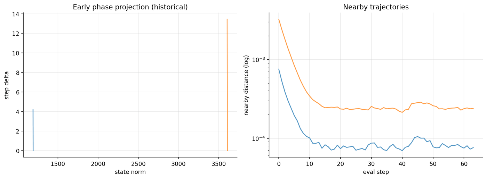
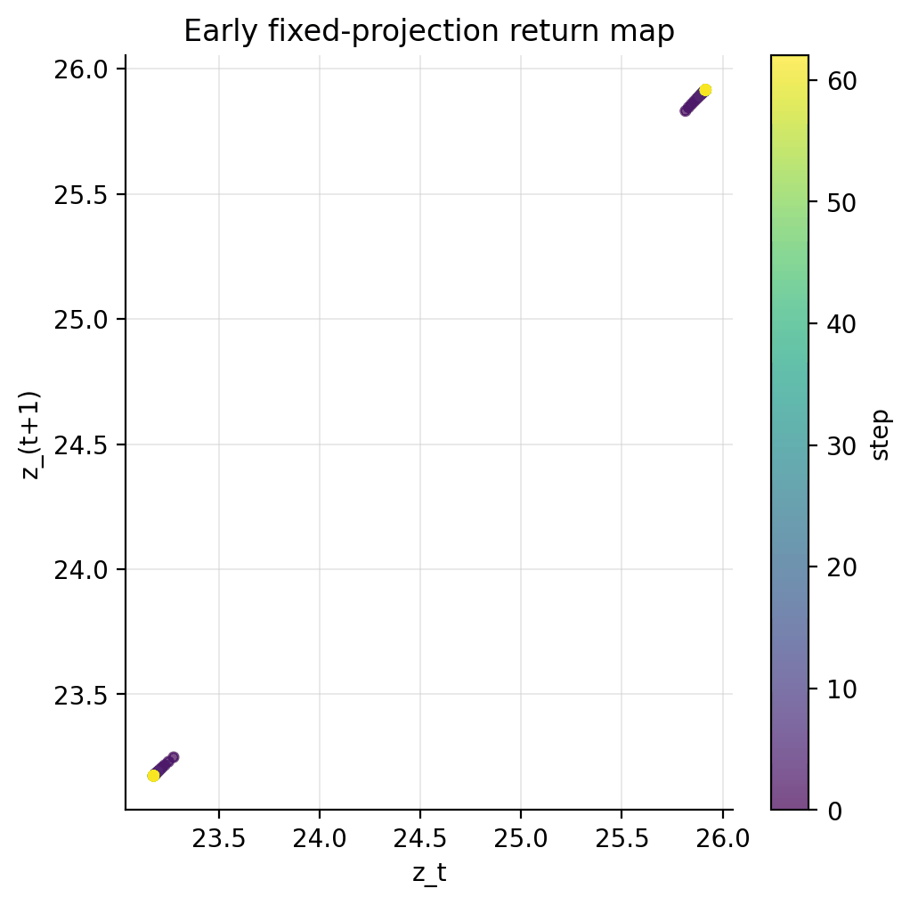

# 阶段二：论文方法重构与早期动力学

## 1. 研究问题

如何把论文中的反馈动力学、邻近轨迹和 Poincaré/return-map 诊断操作化为 LLM 表示空间中的可执行实验？

## 2. 实验和数据来源

覆盖 dynamical-edge smoke、metrics、projection64 和首批 Poincaré/return-map 结果。反馈链为 hidden state → logits → token distribution/embedding → 下一 hidden state，并保持输入输出维度一致。

## 3. 核心参数

operator 类型、burn-in、evaluation steps、epsilon、projection seed/维度、样本和序列长度。早期实验尚未使用修正后的 Benettin 重归一化协议。

`training step`、`dynamics step`、闭环算子和 historical nearby/product metric 的技术定义见[主报告技术说明](../experiment_visualization_review.md#先澄清报告中的-step-到底是什么)。

## 4. 图表

## 5. 结果解释

早期图证明闭环迭代与投影轨迹能够被记录，并暴露不同样本的收敛/非收敛差异；它们主要承担方法开发与故障定位作用。

## 6. 已发现缺陷与更正

旧 `product_log_gain` 只是随机方向连续增益的乘积，既没有持续对齐最大扩张方向，也没有规范的重归一化，因此不能称为最大 Lyapunov。旧 nearby-ratio 同样受 epsilon 和饱和影响。上述图统一标记为 historical，不进入主结论。

## 7. 当前能证明、不能证明的假设

能证明：LLM 同维 embedding-feedback 算子和轨迹诊断在工程上可实现。不能证明：早期投影的扩散形状等价于混沌吸引子，或旧 product metric 对应论文方法3。

## 8. 下一阶段为什么发生

闭环算子并非唯一。为判断观察到的“临界”是否是模型性质还是 operator choice 的产物，下一阶段扩展到跨模型和替代算子。
