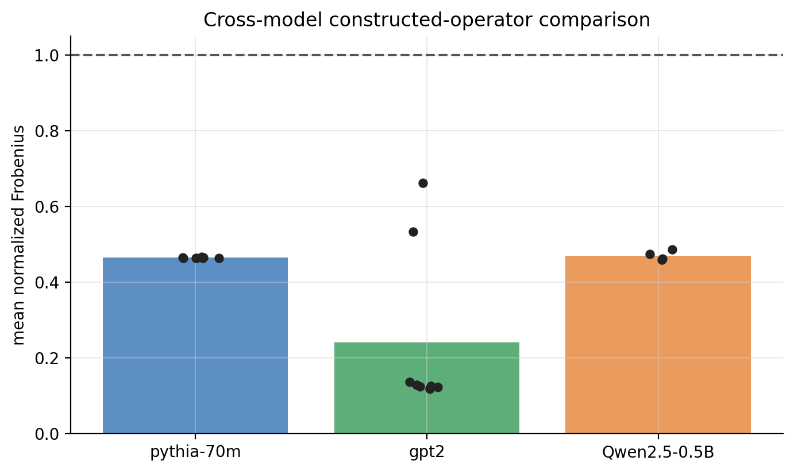
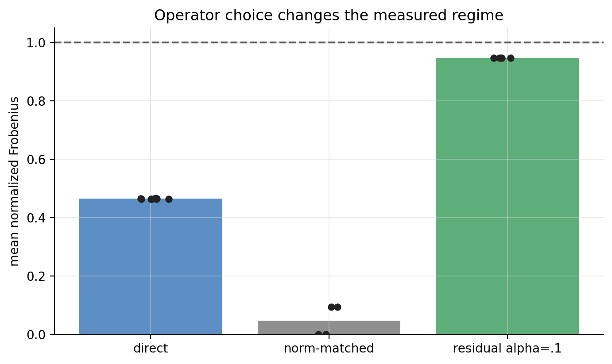
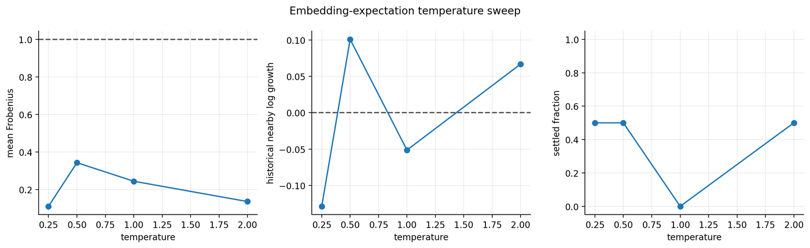

# 阶段三：跨模型与替代算子探索

## 1. 研究问题

所谓临界状态是否跨模型稳定？norm-matched、residual、embedding-expectation 和温度等算子选择会怎样改变轨迹？

## 2. 实验和数据来源

覆盖 Pythia/GPT-2/Qwen normal dynamics、长 burn-in、norm-matched、residual、embedding-expectation 和 temperature sweep。数据来自对应 `experiments/*dynamical_edge*` 目录及其 processed summary。

## 3. 核心参数

model、operator、residual α、temperature、burn-in、epsilon、样本数和收敛阈值。

direct、residual、norm-matched 和 embedding-expectation 的实际计算公式见[主报告“实际计算的 LLM 闭环算子”](../experiment_visualization_review.md#实际计算的-llm-闭环算子)。特别注意，α 和 temperature 改变的是研究者定义的闭环，不是训练权重本身。

## 4. 图表

## 5. 结果解释

模型与算子共同决定增益、收敛和扰动行为。residual mixing 可人为把平均增益推向 1；norm matching 也可能产生退化轨迹。温度改变 embedding expectation 的局部增益与收敛，说明“临界”不是脱离闭环定义的模型固有标量。

## 6. 已发现缺陷与更正

将 operator 干预导致的 `Frobenius≈1` 直接解释为模型自然临界是错误的。历史温度图中的 nearby 指标保留为探索性证据，不承担最终相位判定。

## 7. 当前能证明、不能证明的假设

能证明：operator choice 对相位诊断有一阶影响。不能证明：某个方便实现的闭环就是唯一“LLM 动力系统”，或跨模型 Frobenius 相近就代表相同 Lyapunov 相位。

## 8. 下一阶段为什么发生

算子敏感性要求先建立可解析的控制组与数值边界，再讨论真实 checkpoint。因此进入 output-gain、residual identity 和 epsilon 校准。
