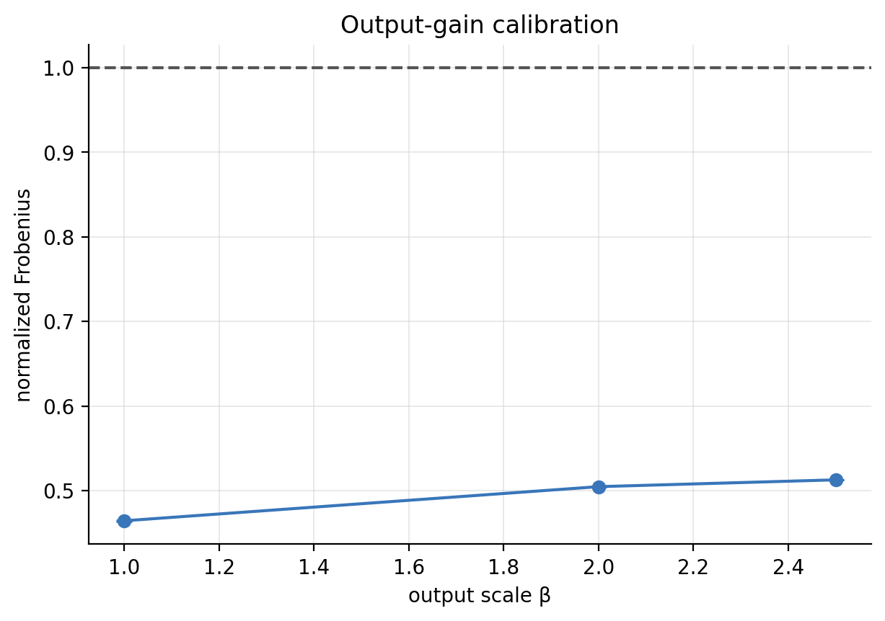
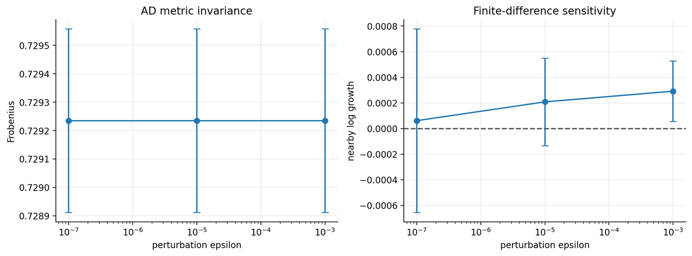

# 阶段四：数值与方法校准

## 1. 研究问题

当前实现能否恢复已知真值？哪些 epsilon 和有限距离诊断在 float32 下可信？显式 output scale 是否是合适的相位控制量？

## 2. 实验和数据来源

覆盖 output-gain、residual identity 和 epsilon sensitivity，使用 `results/processed/pythia_operator_gain_sweep__summary.csv` 以及 `/home/luohaoming/model_feature_experiments/pythia_epsilon_sensitivity/processed/` 数据。

## 3. 核心参数

output scale β、residual α、epsilon=`1e-3/1e-5/1e-7`、JVP probes、nearby distance 和 float32 精度。

Frobenius 的 Hutchinson/JVP 估计、finite nearby growth 及其数值限制见[主报告指标定义](../experiment_visualization_review.md#状态扰动和-jacobian-指标的定义)。

## 4. 图表

## 5. 结果解释

简单放大输出并没有产生干净、线性的相位控制，因为后续归一化和非线性改变了整体响应。Frobenius/JVP 在 epsilon 扫描中较稳定，而有限 nearby-distance 在极小 epsilon 下受舍入和相对误差影响明显。

## 6. 已发现缺陷与更正

过去把 `1e-7` 附近的微小正/负增长当作相位证据过于乐观。对 float32，本项目把 `epsilon=1e-3` 作为有限扰动辅助诊断的默认值；主判据改为 Benettin Lyapunov。

## 7. 当前能证明、不能证明的假设

能证明：实现对 epsilon 的敏感区间可被识别，output gain 不是干净控制。不能证明：nearby 曲线局部斜率就是渐近最大 Lyapunov。

## 8. 下一阶段为什么发生

下一步必须用解析真值明确的恒等/收缩映射检查修正后的 Lyapunov 流水线，建立 checkpoint 结论的测量基础。
