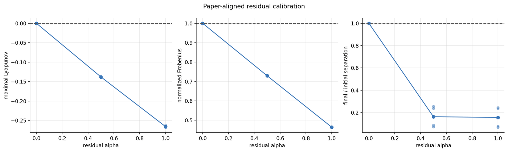
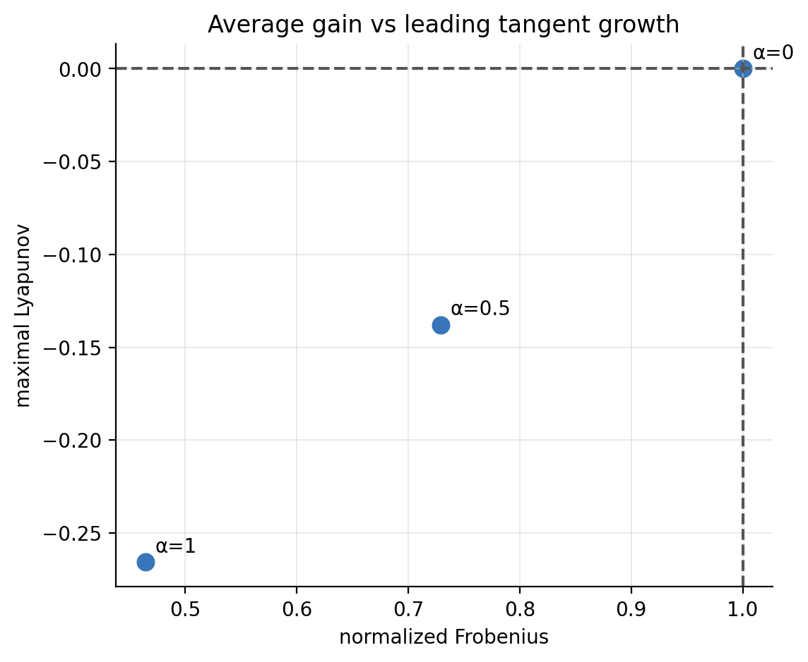

# 阶段五：修正后的 Lyapunov 重测

## 1. 研究问题

Benettin 重归一化实现能否恢复恒等映射 `Lyapunov=0`、`Frobenius=1`、`separation=1`，并对收缩映射给出一致的负 Lyapunov？

## 2. 实验和数据来源

覆盖核心论文方法审计与 paper-aligned Lyapunov remeasurement，主要数据位于 `/home/luohaoming/model_feature_experiments/paper_aligned_lyapunov_remeasurement/processed/`。

## 3. 核心参数

residual α、burn-in、Lyapunov renormalization steps、epsilon=`1e-3`、Frobenius probes、样本数。

Benettin/JVP 每步传播与重归一化公式见[主报告“最大有限时间 Lyapunov”](../experiment_visualization_review.md#最大有限时间-lyapunovbenettinjvp)。α=0 是恒等映射控制，不是一个重新训练的模型。

## 4. 图表

## 5. 结果解释

α=0 的恒等锚点恢复了三项解析真值；增加 α 后，最大 Lyapunov、Frobenius 和最终/初始扰动分离共同进入收缩区。测量流水线因而具备基本判别效度。

## 6. 已发现缺陷与更正

旧随机方向增益不再被称为 Lyapunov。现在每步让扰动沿轨道传播、记录对数增长并重归一化，避免有限距离饱和和方向丢失。

## 7. 当前能证明、不能证明的假设

能证明：实现可区分已知的中性与收缩控制。不能证明：Frobenius 与 Lyapunov 在所有结构化 Transformer Jacobian 上等价，也不能仅凭校准证明 direct operator 具有科学唯一性。

## 8. 下一阶段为什么发生

完成测量校准后，才有资格在相同样本和协议下审计训练 checkpoint 的相位变化。
